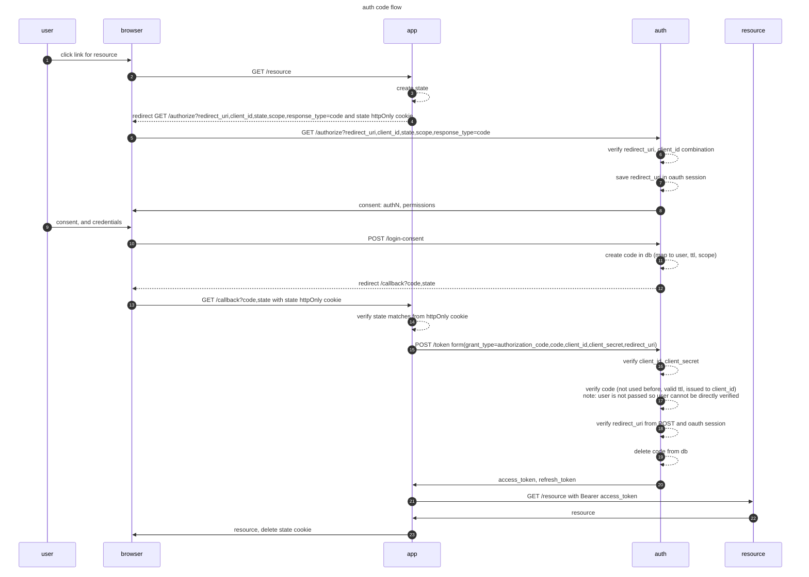
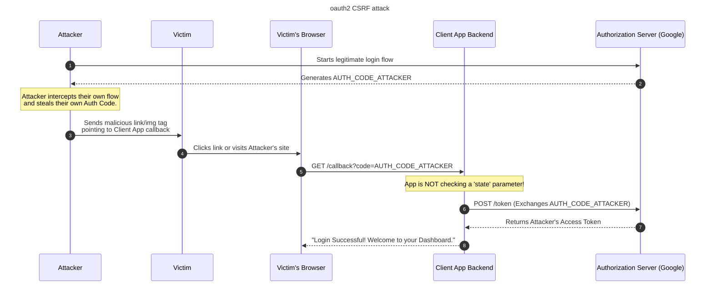

## oauth2 flows

### oauth2 auth code flow

```mermaid
sequenceDiagram
	title auth code flow
	
	autonumber
	participant user
	participant browser
	participant app
	participant auth
	participant resource
	
	user->>browser: click link for resource
	browser->>app: GET /resource
	app-->>app: create state
	app-->>browser: redirect GET /authorize?redirect_uri,client_id,state,scope,response_type=code and state httpOnly cookie
	browser->>auth: GET /authorize?redirect_uri,client_id,state,scope,response_type=code
	auth-->>auth: verify redirect_uri, client_id combination
	auth-->>auth: save redirect_uri in oauth session
	auth->>browser: consent: authN, permissions
	user->>browser: consent, and credentials
	browser->>auth: POST /login-consent
	auth-->>auth: create code in db (map to user, ttl, scope)
	auth-->>browser: redirect /callback?code,state
	browser->>app: GET /callback?code,state with state httpOnly cookie
	app-->>app: verify state matches from httpOnly cookie
	app->>auth: POST /token form(grant_type=authorization_code,code,client_id,client_secret,redirect_uri)
	auth-->>auth: verify client_id, client_secret
	auth-->>auth: verify code (not used before, valid ttl, issued to client_id) <br> note: user is not passed so user cannot be directly verified
	auth-->>auth: verify redirect_uri from POST and oauth session
	auth-->>auth: delete code from db
	auth->>app: access_token, refresh_token
	app->>resource: GET /resource with Bearer access_token
	resource->>app: resource
	app->>browser: resource, delete state cookie
```

### oauth2 CSRF attack

```mermaid
sequenceDiagram
	title oauth2 CSRF attack
	
	autonumber
	participant Attacker
	participant Victim
	participant Browser as Victim's Browser
	participant App as Client App Backend
	participant AS as Authorization Server (Google)
	
	%% Step 1-2: Attacker gets a code
	Attacker->>AS: Starts legitimate login flow
	AS-->>Attacker: Generates AUTH_CODE_ATTACKER
	Note over Attacker: Attacker intercepts their own flow<br/>and steals their own Auth Code.
	
	%% Step 3: Malicious Link
	Attacker->>Victim: Sends malicious link/img tag<br/>pointing to Client App callback
	
	%% Step 4-6: Victim triggers the attack unknowingly
	Victim->>Browser: Clicks link or visits Attacker's site
	Browser->>App: GET /callback?code=AUTH_CODE_ATTACKER
	Note over App: App is NOT checking a 'state' parameter!
	App->>AS: POST /token (Exchanges AUTH_CODE_ATTACKER)
	AS-->>App: Returns Attacker's Access Token
	App-->>Browser: "Login Successful! Welcome to your Dashboard."
```

### oauth2 auth code flow

```mermaid
sequenceDiagram
	title auth code flow
	
	autonumber
	participant user
	participant browser
	participant app
	participant auth
	participant resource
	
	user->>browser: click link for resource
	browser->>app: GET /resource
	app-->>app: create state
	app-->>browser: redirect GET /authorize?redirect_uri,client_id,state,scope,response_type=code and state httpOnly cookie
	browser->>auth: GET /authorize?redirect_uri,client_id,state,scope,response_type=code
	auth-->>auth: verify redirect_uri, client_id combination
	auth-->>auth: save redirect_uri in oauth session
	auth->>browser: consent: authN, permissions
	user->>browser: consent, and credentials
	browser->>auth: POST /login-consent
	auth-->>auth: create code in db (map to user, ttl, scope)
	auth-->>browser: redirect /callback?code,state
	browser->>app: GET /callback?code,state with state httpOnly cookie
	app-->>app: verify state matches from httpOnly cookie
	app->>auth: POST /token form(grant_type=authorization_code,code,client_id,client_secret,redirect_uri)
	auth-->>auth: verify client_id, client_secret
	auth-->>auth: verify code (not used before, valid ttl, issued to client_id) <br> note: user is not passed so user cannot be directly verified
	auth-->>auth: verify redirect_uri from POST and oauth session
	auth-->>auth: delete code from db
	auth->>app: access_token, refresh_token
	app->>resource: GET /resource with Bearer access_token
	resource->>app: resource
	app->>browser: resource, delete state cookie
```
